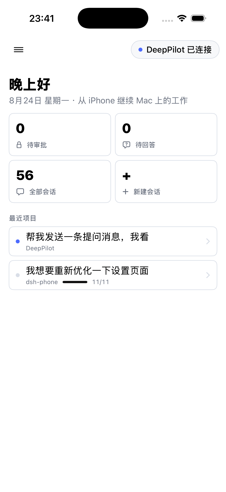
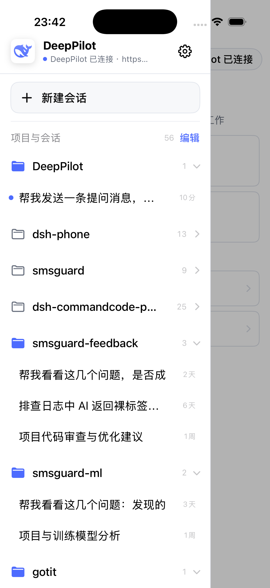
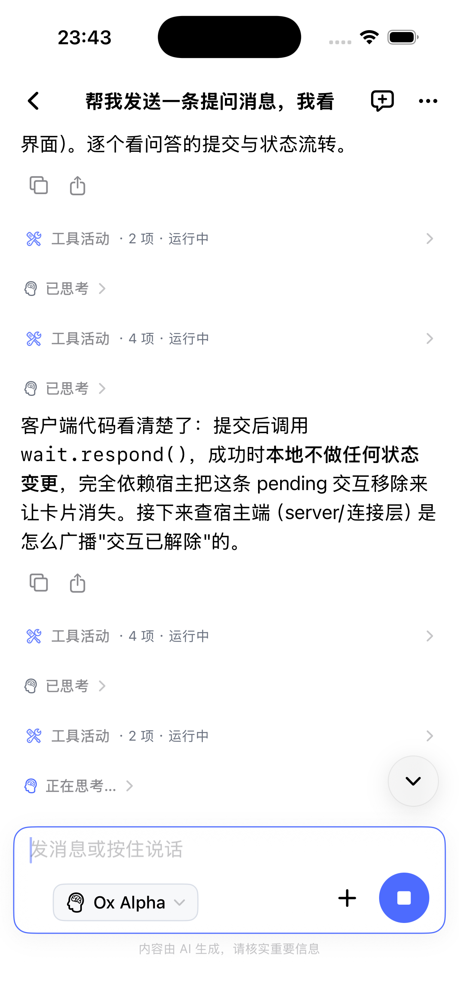
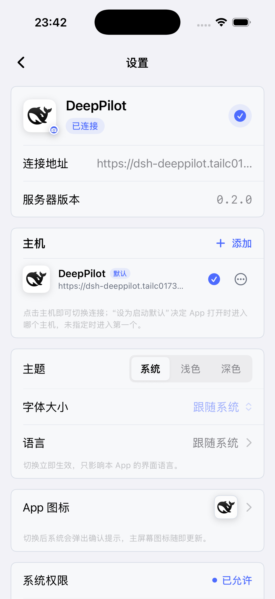

# dsh-deeppilot

**English** | [简体中文](./README.zh-CN.md)

[](https://www.npmjs.com/package/dsh-deeppilot)
[](https://github.com/deepseek-ai/deepseek-harness)
[](https://github.com/Mars-Sea/dsh-deeppilot/actions/workflows/ci.yml)
[](./LICENSE)

The open-source DSH companion plugin for **DeepPilot**, a native iPhone client
for using DeepSeek Harness remotely. It connects the app directly to the DSH
Host on your own Mac and does not replace or modify the DSH Web UI.

> DeepPilot is currently in TestFlight review. The invitation link will accept
> testers after Apple approves the build.

[Join the DeepPilot TestFlight](https://testflight.apple.com/join/JHb4j5DV)

## What you get

- Browse projects, sessions, history, and live agent output from iPhone.
- Send prompts, switch models, create sessions, and answer approvals/questions.
- Pair through a QR code with the secret stored on the Mac and in iOS Keychain.
- Connect over a trusted LAN or the optional embedded Tailscale Funnel.
- Receive live notifications and optional APNs notifications while offline.
- Self-update hint: the settings page footer shows the installed plugin
  version, with an inline "new version" link to the matching GitHub
  release when one exists (background check, stable releases only, no
  third-party dependency).

## Install from npm

Requirements: Node.js 22+, a DSH `web` profile, and macOS. The bundled Funnel
helper currently supports Apple silicon; trusted-LAN mode does not require it.

```sh
dsh plugin --profile web add dsh-deeppilot
dsh web
```

After DSH restarts, open **Settings → DeepPilot**, enable the connection, show
the pairing QR code, and scan it in the DeepPilot app.

Package: [npmjs.com/package/dsh-deeppilot](https://www.npmjs.com/package/dsh-deeppilot)

## Update or uninstall

```sh
dsh plugin --profile web update dsh-deeppilot
dsh plugin --profile web remove dsh-deeppilot
```

Restart DSH after updating. Uninstalling the package does not delete the local
DeepPilot state under `$DSH_HOME/deeppilot/`.

## Connection and privacy

Conversation traffic travels directly between the iPhone and your DSH Host.
Trusted-LAN `ws://` traffic is unencrypted, so use it only on a network you
trust. Optional Funnel mode exposes only the authenticated DeepPilot connection
and health endpoints, not the complete DSH Web UI.

The DeepPilot settings page exposes **Connections per public source** for
Funnel deployments. It defaults to `8`, accepts `1`–`16`, and briefly restarts
the Funnel helper when changed, so connected remote clients reconnect once.

Offline push is optional. Relay mode sends only the target APNs device token
and a limited notification payload; full conversation history and live output
do not pass through the relay. Read [PRIVACY.md](./PRIVACY.md) and
[SECURITY.md](./SECURITY.md) before enabling remote access or push. The proposed
per-device protocol-v2 upgrade is tracked separately in
[docs/SECURITY_ROADMAP.md](./docs/SECURITY_ROADMAP.md).

## Screenshots

| Home | Sidebar | Chat | Settings |
| --- | --- | --- | --- |
|  |  |  |  |

## Compatibility

See [COMPATIBILITY.md](./COMPATIBILITY.md) for the tested baseline and current
limitations. DSH is still evolving; include exact DSH and plugin versions when
reporting an issue.

## Protocol

[PROTOCOL.md](./PROTOCOL.md) is the normative DeepPilot bridge protocol. Any
wire change must update that document and `src/protocol.ts` together, preserve
protocol-v1 compatibility, and be coordinated with the private iOS client.

## Development

```sh
npm ci
npm test
npm run typecheck
npm run build
cd helper && go test ./...
```

## Community and feedback

- [GitHub Issues](https://github.com/Mars-Sea/dsh-deeppilot/issues)
- [GitHub Releases](https://github.com/Mars-Sea/dsh-deeppilot/releases)
- [npm package](https://www.npmjs.com/package/dsh-deeppilot)
- [Linux.do 社区](https://linux.do/)

DeepPilot is an independent community project and is not affiliated with or
endorsed by DeepSeek.

## License

MIT — see [LICENSE](./LICENSE).
